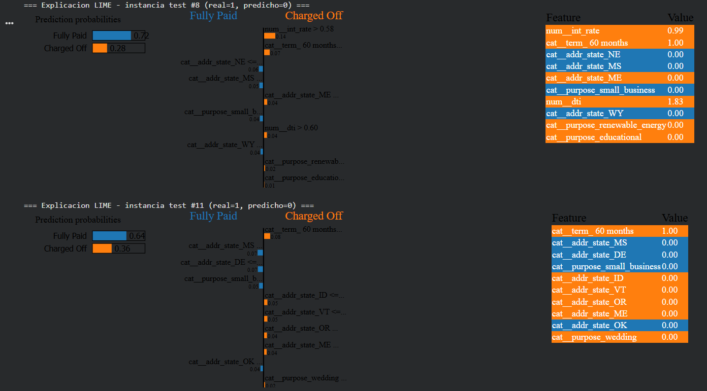

# 5. Interpretabilidad con LIME

## 5.1 Selección del modelo

Se aplicó LIME al modelo con mayor AUC **entre los que entregan probabilidades**
(se excluye `LinearSVC`, que no produce `predict_proba`): en scikit-learn, este modelo es
**`GradientBoosting`** (AUC = 0.7162), que además fue el mejor modelo global de todo el
estudio.

## 5.2 Instancias explicadas

Sobre el conjunto de prueba, `GradientBoosting` clasificó incorrectamente **48,852**
observaciones (de 253,196, ≈19.3% de error — consistente con su accuracy de 0.8071). Se
seleccionaron dos instancias mal clasificadas para explicar con
`lime.lime_tabular.LimeTabularExplainer` (10 variables más influyentes por instancia):

- **Instancia de prueba #8**: valor real = 1 (default), predicho = 0 (no default) →
  **falso negativo**.
- **Instancia de prueba #11**: valor real = 1 (default), predicho = 0 (no default) →
  **falso negativo**.

```{note}
Que las **dos** instancias examinadas hayan resultado falsos negativos no es casualidad:
dado que `GradientBoosting` tiene un recall de solo **0.0627** (ver {doc}`03_modelado`),
la inmensa mayoría de sus errores en la clase positiva son falsos negativos — el modelo,
al umbral 0.5, casi nunca se "arriesga" a predecir default, incluso cuando el préstamo
efectivamente termina en `Charged Off`.
```

## 5.3 Interpretación cualitativa

A continuación, se presentan las explicaciones visuales de LIME con las variables más influyentes para los dos errores de predicción:



El análisis detallado de los gráficos revela el comportamiento interno del modelo ante los dos falsos negativos:

- **Instancia #8:** El modelo predijo "Fully Paid" con una probabilidad de 0.72. Las variables que correctamente empujaban la predicción hacia el default (Charged Off) fueron una tasa de interés alta (`num__int_rate > 0.58`) con un peso de 0.14, un plazo de 60 meses (`cat__term_60 months`) con un peso de 0.07, y una alta relación deuda-ingreso (`num__dti > 0.60`) con un peso de 0.04. Sin embargo, esta señal de riesgo fue contrarrestada por múltiples variables geográficas y de propósito del préstamo (estados NE, MS, ME, WY y propósito `small_business`), las cuales sumaron el peso suficiente en la dirección opuesta para inclinar la balanza hacia la clase negativa.
- **Instancia #11:** El modelo predijo "Fully Paid" con una probabilidad de 0.64. Nuevamente, el plazo de 60 meses actuó como el principal indicador de riesgo de default (peso de 0.08). No obstante, una acumulación masiva de variables categóricas geográficas (estados MS, DE, ID, VT, OR, ME, OK) y el propósito `small_business` dominaron la predicción local a favor del pago completo.

**Conclusión del análisis local:** Las explicaciones de LIME demuestran que el modelo sufre de una sobredependencia en variables categóricas dispersas (específicamente la ubicación estatal del prestatario y el propósito del préstamo) al momento de tomar decisiones límite. Aunque el modelo captura correctamente señales financieras fuertes (como tasas de interés altas y plazos largos), el "ruido" introducido por la codificación de múltiples estados termina diluyendo el riesgo real, forzando al modelo a predecir "Fully Paid" de manera errónea.

## 5.4 Limitaciones de LIME en un entorno distribuido

LIME opera en memoria local: recibe un arreglo NumPy y una función `predict_proba` de
Python que evalúa cientos o miles de perturbaciones sintéticas alrededor de la instancia a
explicar. Aplicarlo directamente a un `PipelineModel` de PySpark no es sencillo, porque
habría que envolver `mejor_modelo.transform(...)` en una función que reciba arrays y
ejecute internamente un *job* de Spark por cada perturbación — con la sobrecarga de
lanzar miles de jobs distribuidos solo para explicar una instancia, lo cual es lento e
impráctico a gran escala.

Por esta razón, en este proyecto se aplicó LIME únicamente sobre el mejor modelo de
**scikit-learn**. Alternativas para el caso PySpark, no exploradas aquí por su costo
computacional, incluirían: (a) exportar una muestra representativa y entrenar un modelo
equivalente en scikit-learn solo con fines de explicabilidad (con la advertencia de que
introduce una aproximación, ya que no es exactamente el modelo distribuido evaluado), o
(b) usar métodos de interpretabilidad nativos de Spark (p. ej. `featureImportances` de
`RandomForestClassificationModel`/`GBTClassificationModel`), que son globales y no
locales como LIME.
